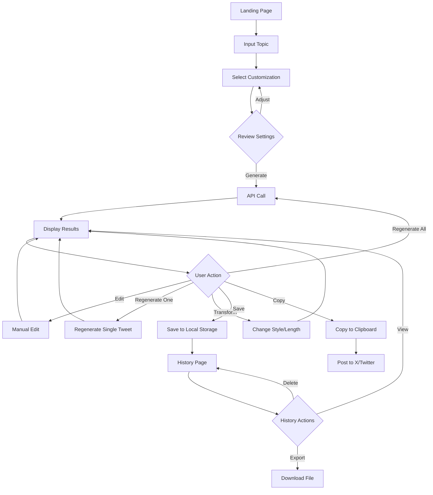

# AI Tweet/Thread Generator - Architecture Plan

## 📋 Overview

Aplikasi web berbasis AI untuk menghasilkan tweet dan thread Twitter/X yang menarik dan berpotensi viral. Dibangun dengan Next.js, TypeScript, Shadcn UI, dan OpenAI-compatible API provider dengan penyimpanan lokal.

---

## 🎯 Core Features

### 1. Input & Customization

- **Topic Input**: Text area untuk memasukkan topik/ide
- **Format Selection**: Single tweet atau thread (1-25 tweets)
- **Writing Style**: Profesional, Santai, Storytelling, Edukatif, Humoris, Kontroversial, Persuasive, Inspirational, News-style
- **Tone**: Friendly, Confident, Witty, Authoritative, Emotional, Casual, Formal, Sarcastic
- **Target Audience**: General, Professionals, Students, Entrepreneurs, Tech enthusiasts, Custom
- **Language**: Indonesia, English
- **Content Goal**: Engagement, Personal Branding, Education, Promotion, Follower Growth
- **Length**: Short (150-200 char), Medium (200-250 char), Long (250-280 char)
- **Options**:
  - Use Hook (strong opening)
  - Add CTA (call-to-action)
  - Include Emojis
  - Add Hashtags (custom atau auto-generated)

### 2. Content Generation

- Generate dengan OpenAI-compatible API
- Menghasilkan 1-5 versi berbeda sekaligus
- Setiap tweet memiliki:
  - Hook yang kuat (untuk tweet pertama)
  - Value proposition jelas
  - Alur yang natural
  - Transisi menarik antar tweet
  - Optimasi engagement
  - CTA di akhir thread (opsional)

### 3. Content Management

- **Edit Manual**: Edit setiap tweet secara individual
- **Regenerate**:
  - Regenerate seluruh thread
  - Regenerate tweet spesifik saja
- **Transform**:
  - Ubah style/tone
  - Perpendek tulisan
  - Perpanjang tulisan
- **Copy to Clipboard**: Format siap post ke X/Twitter
- **Save Locally**: Simpan ke localStorage dengan metadata

### 4. History & Library

- Lihat semua tweets/threads yang pernah dibuat
- Filter berdasarkan: tanggal, format, style, topic
- Search functionality
- Delete individual items
- Export ke JSON/TXT

---

## 🏗️ Technical Architecture

### Tech Stack

```
Frontend: Next.js 14+ (App Router)
Language: TypeScript
UI Library: Shadcn UI + Tailwind CSS
State Management: React Context / Zustand
Storage: localStorage (browser)
AI Provider: OpenAI-compatible API (9router, OpenRouter, dll)
Package Manager: npm/pnpm/yarn
```

### Project Structure

```
threads-maker/
├── app/
│   ├── (routes)/
│   │   ├── page.tsx                 # Main generator page
│   │   ├── history/
│   │   │   └── page.tsx             # History/library page
│   │   └── layout.tsx
│   ├── api/
│   │   └── generate/
│   │       └── route.ts             # API endpoint untuk AI generation
│   ├── globals.css
│   └── layout.tsx
├── components/
│   ├── ui/                          # Shadcn UI components
│   │   ├── button.tsx
│   │   ├── input.tsx
│   │   ├── textarea.tsx
│   │   ├── select.tsx
│   │   ├── card.tsx
│   │   ├── badge.tsx
│   │   ├── dialog.tsx
│   │   ├── toast.tsx
│   │   └── ...
│   ├── generator/
│   │   ├── TopicInput.tsx
│   │   ├── CustomizationPanel.tsx
│   │   ├── StyleSelector.tsx
│   │   ├── ToneSelector.tsx
│   │   └── AdvancedOptions.tsx
│   ├── results/
│   │   ├── ThreadPreview.tsx
│   │   ├── TweetCard.tsx
│   │   ├── TweetActions.tsx
│   │   └── VersionTabs.tsx
│   ├── history/
│   │   ├── HistoryList.tsx
│   │   ├── HistoryItem.tsx
│   │   └── HistoryFilters.tsx
│   └── shared/
│       ├── Header.tsx
│       ├── LoadingSpinner.tsx
│       └── EmptyState.tsx
├── lib/
│   ├── ai/
│   │   ├── client.ts                # OpenAI client setup
│   │   ├── prompts.ts               # Prompt templates
│   │   └── generator.ts             # Generation logic
│   ├── storage/
│   │   ├── localStorage.ts          # localStorage utilities
│   │   └── exportUtils.ts           # Export functionality
│   ├── utils/
│   │   ├── formatting.ts            # Text formatting helpers
│   │   ├── validation.ts            # Input validation
│   │   └── clipboard.ts             # Clipboard utilities
│   └── utils.ts                     # General utilities
├── types/
│   ├── thread.ts                    # Thread/Tweet types
│   ├── generator.ts                 # Generator config types
│   └── storage.ts                   # Storage types
├── hooks/
│   ├── useLocalStorage.ts
│   ├── useGenerator.ts
│   └── useClipboard.ts
├── config/
│   ├── ai-provider.ts               # AI provider configuration
│   └── app-config.ts                # App constants
├── public/
│   └── ...
├── .env.local
├── next.config.js
├── tsconfig.json
├── tailwind.config.ts
├── components.json                  # Shadcn config
└── package.json
```

---

## 📦 Data Models

### Thread Type

```typescript
interface Tweet {
  id: string;
  content: string;
  order: number;
  charCount: number;
  hasEmoji: boolean;
  hashtags: string[];
}

interface ThreadMetadata {
  id: string;
  createdAt: string;
  updatedAt: string;
  topic: string;
  format: "single" | "thread";
  style: WritingStyle;
  tone: Tone;
  language: Language;
  targetAudience: string;
  contentGoal: ContentGoal;
  settings: GeneratorSettings;
}

interface GeneratedThread {
  metadata: ThreadMetadata;
  tweets: Tweet[];
  totalTweets: number;
  totalChars: number;
  version: number;
}

interface SavedThread extends GeneratedThread {
  isFavorite: boolean;
  tags: string[];
  notes: string;
}
```

### Generator Config

```typescript
type WritingStyle =
  | "professional"
  | "casual"
  | "storytelling"
  | "educational"
  | "humorous"
  | "controversial"
  | "persuasive"
  | "inspirational"
  | "news";

type Tone =
  | "friendly"
  | "confident"
  | "witty"
  | "authoritative"
  | "emotional"
  | "casual"
  | "formal"
  | "sarcastic";

type ContentGoal =
  | "engagement"
  | "personal-branding"
  | "education"
  | "promotion"
  | "follower-growth";

type Language = "id" | "en";

type TweetLength = "short" | "medium" | "long";

interface GeneratorSettings {
  numberOfTweets: number; // 1-25
  numberOfVersions: number; // 1-5
  useHook: boolean;
  useCTA: boolean;
  includeEmojis: boolean;
  includeHashtags: boolean;
  customHashtags?: string[];
  tweetLength: TweetLength;
}
```

---

## 🔄 User Flow



---

## 🎨 UI/UX Design

### Main Generator Page

```
┌─────────────────────────────────────────────────────────┐
│  🧵 Thread Maker                           [History]     │
├─────────────────────────────────────────────────────────┤
│                                                           │
│  ┌─────────────────────────────────────────────────┐   │
│  │  What do you want to tweet about?               │   │
│  │  ┌────────────────────────────────────────────┐│   │
│  │  │ Enter your topic or idea...                ││   │
│  │  │                                             ││   │
│  │  └────────────────────────────────────────────┘│   │
│  └─────────────────────────────────────────────────┘   │
│                                                           │
│  ┌──────────────────┐  ┌──────────────────┐            │
│  │ Format: Thread ▼ │  │ # Tweets: 5   ▼  │            │
│  └──────────────────┘  └──────────────────┘            │
│                                                           │
│  ┌──────────────────┐  ┌──────────────────┐            │
│  │ Style: Casual  ▼ │  │ Tone: Friendly ▼ │            │
│  └──────────────────┘  └──────────────────┘            │
│                                                           │
│  [+] Advanced Options                                    │
│                                                           │
│  ┌──────────────────────────────┐                       │
│  │  🎯 Generate Thread          │                       │
│  └──────────────────────────────┘                       │
│                                                           │
│  ┌─────────────────────────────────────────────────┐   │
│  │  📝 Generated Results                            │   │
│  │  ┌──────┬──────┬──────┬──────┐                 │   │
│  │  │ V1   │ V2   │ V3   │ V4   │  (Version Tabs) │   │
│  │  └──────┴──────┴──────┴──────┘                 │   │
│  │                                                  │   │
│  │  ┌──────────────────────────────────┐          │   │
│  │  │ 1/5  🔥 Hook tweet here...       │  [Edit]  │   │
│  │  │      📊 280 chars                │  [Regen] │   │
│  │  └──────────────────────────────────┘          │   │
│  │                                                  │   │
│  │  ┌──────────────────────────────────┐          │   │
│  │  │ 2/5  Value content here...       │  [Edit]  │   │
│  │  │      📊 250 chars                │  [Regen] │   │
│  │  └──────────────────────────────────┘          │   │
│  │  ...                                            │   │
│  │                                                  │   │
│  │  [✏️ Edit All] [🔄 Regenerate] [📋 Copy]       │   │
│  │  [💾 Save] [🎨 Change Style] [📏 Adjust]       │   │
│  └─────────────────────────────────────────────────┘   │
└─────────────────────────────────────────────────────────┘
```

### History Page

```
┌─────────────────────────────────────────────────────────┐
│  📚 Thread History                      [← Back]         │
├─────────────────────────────────────────────────────────┤
│                                                           │
│  [Search...] [Filter ▼] [Sort ▼]                        │
│                                                           │
│  ┌─────────────────────────────────────────────────┐   │
│  │ 📅 Dec 15, 2024 - 3:45 PM              Thread   │   │
│  │ Topic: "AI dalam kehidupan sehari-hari"         │   │
│  │ Style: Educational | Tone: Friendly              │   │
│  │ 5 tweets • 1,250 chars                           │   │
│  │ [👁️ View] [📋 Copy] [🗑️ Delete]                  │   │
│  └─────────────────────────────────────────────────┘   │
│                                                           │
│  ┌─────────────────────────────────────────────────┐   │
│  │ ...                                              │   │
│  └─────────────────────────────────────────────────┘   │
└─────────────────────────────────────────────────────────┘
```

---

## 🤖 AI Integration

### Prompt Engineering Strategy

#### System Prompt Template

```
You are an expert social media content creator specializing in viral Twitter/X content.
Your task is to create engaging, natural-sounding tweets and threads that:

1. Hook readers immediately with the first tweet
2. Provide clear value in every tweet
3. Use natural, conversational language (not robotic)
4. Create smooth transitions between tweets
5. Optimize for engagement (likes, replies, retweets, bookmarks)
6. Stay factual and avoid unverifiable claims
7. Match the specified writing style and tone
8. Consider the target audience

Rules:
- Each tweet must be under 280 characters
- Use line breaks strategically for readability
- Include emojis only if specified
- Add hashtags only if specified
- Create a strong CTA if requested
- Maintain consistent voice throughout the thread
```

#### Dynamic User Prompt

```typescript
function buildPrompt(config: GeneratorConfig): string {
  return `
Topic: ${config.topic}

Format: ${config.format === "thread" ? `Thread with ${config.numberOfTweets} tweets` : "Single tweet"}

Writing Style: ${config.style}
Tone: ${config.tone}
Language: ${config.language}
Target Audience: ${config.targetAudience}
Content Goal: ${config.contentGoal}

Requirements:
- Tweet length preference: ${config.tweetLength}
${config.useHook ? "- Start with a powerful hook" : ""}
${config.useCTA ? "- End with a clear call-to-action" : ""}
${config.includeEmojis ? "- Include relevant emojis" : "- No emojis"}
${config.includeHashtags ? "- Add relevant hashtags" : "- No hashtags"}

Generate ${config.numberOfVersions} different version(s).

Output format: JSON array of threads, each containing an array of tweet objects with content.
`;
}
```

### API Route Implementation

```typescript
// app/api/generate/route.ts
export async function POST(req: Request) {
  const config = await req.json();

  // Build prompt
  const prompt = buildPrompt(config);

  // Call OpenAI-compatible API
  const response = await fetch(OPENAI_API_ENDPOINT, {
    method: "POST",
    headers: {
      Authorization: `Bearer ${API_KEY}`,
      "Content-Type": "application/json",
    },
    body: JSON.stringify({
      model: MODEL_NAME,
      messages: [
        { role: "system", content: SYSTEM_PROMPT },
        { role: "user", content: prompt },
      ],
      temperature: 0.8, // More creative
      max_tokens: 2000,
    }),
  });

  // Parse and return results
  return NextResponse.json(results);
}
```

---

## 💾 Local Storage Strategy

### Storage Structure

```typescript
// localStorage keys
const STORAGE_KEYS = {
  THREADS: "threads_maker_threads",
  SETTINGS: "threads_maker_settings",
  API_CONFIG: "threads_maker_api_config",
};

// Storage format
interface LocalStorageData {
  threads: SavedThread[];
  lastUpdated: string;
  version: string;
}
```

### Storage Operations

```typescript
// Save thread
function saveThread(thread: GeneratedThread): void {
  const existing = getThreads();
  existing.push({
    ...thread,
    isFavorite: false,
    tags: [],
    notes: "",
  });
  localStorage.setItem(STORAGE_KEYS.THREADS, JSON.stringify(existing));
}

// Get all threads
function getThreads(): SavedThread[] {
  const data = localStorage.getItem(STORAGE_KEYS.THREADS);
  return data ? JSON.parse(data) : [];
}

// Delete thread
function deleteThread(id: string): void {
  const existing = getThreads();
  const filtered = existing.filter((t) => t.metadata.id !== id);
  localStorage.setItem(STORAGE_KEYS.THREADS, JSON.stringify(filtered));
}

// Export threads
function exportThreads(format: "json" | "txt"): void {
  const threads = getThreads();
  // Format and download
}
```

---

## 🔧 Environment Configuration

### Required Environment Variables

```env
# .env.local
NEXT_PUBLIC_OPENAI_API_ENDPOINT=https://api.9router.com/v1
OPENAI_API_KEY=your_api_key_here
OPENAI_MODEL_NAME=gpt-4o-mini

# Optional
NEXT_PUBLIC_APP_NAME=Thread Maker
NEXT_PUBLIC_MAX_THREADS_STORAGE=100
```

### Configuration File

```typescript
// config/ai-provider.ts
export const AI_CONFIG = {
  endpoint: process.env.NEXT_PUBLIC_OPENAI_API_ENDPOINT,
  apiKey: process.env.OPENAI_API_KEY,
  model: process.env.OPENAI_MODEL_NAME,
  temperature: 0.8,
  maxTokens: 2000,
};
```

---

## 🎯 Key Features Implementation Details

### 1. Multiple Version Generation

- Generate 1-5 versions in single API call
- Display in tabs
- Allow switching between versions
- Each version has independent edit/regenerate

### 2. Regenerate Functionality

```typescript
// Regenerate entire thread
async function regenerateThread(
  threadId: string,
  config: GeneratorConfig,
): Promise<GeneratedThread>;

// Regenerate single tweet
async function regenerateTweet(
  threadId: string,
  tweetIndex: number,
  context: Tweet[],
): Promise<Tweet>;
```

### 3. Transform Operations

```typescript
// Change style/tone
async function transformStyle(
  thread: GeneratedThread,
  newStyle: WritingStyle,
  newTone: Tone,
): Promise<GeneratedThread>;

// Adjust length
async function adjustLength(
  tweet: Tweet,
  direction: "shorten" | "lengthen",
): Promise<Tweet>;
```

### 4. Copy to Clipboard

```typescript
function formatForTwitter(thread: GeneratedThread): string {
  return thread.tweets
    .map((tweet, i) => `${i + 1}/${thread.totalTweets}\n\n${tweet.content}`)
    .join("\n\n---\n\n");
}
```

---

## 📊 Optimization Strategies

### Performance

- Lazy load history items
- Debounce form inputs
- Cache API responses temporarily
- Optimize localStorage reads/writes
- Use React.memo for tweet cards

### UX Enhancements

- Loading states with skeletons
- Optimistic UI updates
- Toast notifications for actions
- Keyboard shortcuts (Ctrl+Enter to generate)
- Auto-save drafts
- Character counter with visual feedback

### Error Handling

- API error fallbacks
- localStorage quota exceeded handling
- Network timeout handling
- Invalid input validation
- Rate limiting feedback

---

## 🚀 Development Phases

### Phase 1: Foundation

- Setup Next.js project with TypeScript
- Install and configure Shadcn UI
- Create basic folder structure
- Setup environment variables
- Create type definitions

### Phase 2: Core Generator

- Build main generator page UI
- Implement customization form
- Create API route for AI generation
- Connect form to API
- Display generated results

### Phase 3: Content Management

- Implement edit functionality
- Add regenerate features (all/single)
- Create transform operations
- Add copy to clipboard
- Implement local storage

### Phase 4: History & Polish

- Build history page
- Add filtering and search
- Implement export functionality
- Add error handling
- Optimize performance

### Phase 5: Testing & Launch

- Test all features
- Fix bugs
- Optimize UX
- Add documentation
- Deploy (if needed)

---

## 📝 Additional Considerations

### Accessibility

- Keyboard navigation
- ARIA labels
- Screen reader support
- Color contrast compliance

### Browser Compatibility

- Test on Chrome, Firefox, Safari, Edge
- Handle localStorage limitations
- Fallback for disabled JavaScript

### Future Enhancements (Post-MVP)

- Dark mode
- Custom style templates
- Thread analytics
- Scheduling integration
- Team collaboration
- Cloud sync (optional)
- Mobile responsive PWA
- Export to images

---

## 🔐 Security & Privacy

- No user data sent to external servers (except AI API)
- API keys stored in environment variables
- Client-side encryption for sensitive data (optional)
- No tracking or analytics
- All data stored locally in user's browser

---

## 📚 Dependencies

### Core Dependencies

```json
{
  "dependencies": {
    "next": "^14.0.0",
    "react": "^18.0.0",
    "react-dom": "^18.0.0",
    "typescript": "^5.0.0",
    "tailwindcss": "^3.4.0",
    "@radix-ui/react-*": "latest",
    "class-variance-authority": "^0.7.0",
    "clsx": "^2.1.0",
    "lucide-react": "^0.300.0",
    "tailwind-merge": "^2.2.0",
    "zustand": "^4.5.0" // optional for state
  }
}
```

---

## 🎓 Learning Resources

- Next.js 14 App Router
- Shadcn UI components
- OpenAI API documentation
- Twitter/X best practices
- localStorage API
- TypeScript best practices

---

## ✅ Success Metrics

- Generate high-quality threads in < 10 seconds
- Support 100+ saved threads in localStorage
- Smooth UX with no lag
- 99% uptime for API calls
- Positive user feedback on content quality
